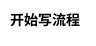

<center><h1>GFM格式参考</h1></center>

---

## 列表
1. 大大大大
2. 大大大大
3. 大大大大
4. d大大大
   
- 无序列表
- dadad
- dadada
- dadada
- dada

- [x] 任务列表
- [ ] 任务列表
- [x] 任务列表

## 链接测试
[text](https://www.baidu.com)
[text][baidu]

[baidu]:https://www.baidu.com

@import "./gfmimg/lala.png" {width="100px" height="100px" title="title" alt="alt"}


> dkajdkajdak
> 
> dakdjakdaj

## 表格
居左|居中|居右
:--|:--:|--:
你好|markdown|thanks
你好|markdown|thanks
你好|markdown|thanks

## 代码块
我觉得你应该在这里使用`<addr>`才对
```javascript
console.log("Hello World");
```

## 修饰
*斜体*

**粗体**

***粗斜体***

{++添加++}

{--删除--}

==高亮==

111^上标^111

222~下标~222

<ruby>text<rp>(</rp><rt>拼音</rt><rp>)</rp></ruby>

## 脚注
12121212121212<sup><a id="a1" href="#a2">引用上标</a></sup>


## 数学表达式
$ f(x) = sin(x) +12 $


$$
J(\theta) = \frac{1}{2m}\sum_{i = 0} ^m(y^i - h_\theta (x^i))^2
$$

## 思维图



```vega-lite
{
  "$schema": "https://vega.github.io/schema/vega-lite/v2.json",
  "description": "A simple bar chart with embedded data.",
  "data": {
    "values": [
      {"a": "A","b": 28}, {"a": "B","b": 55}, {"a": "C","b": 43},
      {"a": "D","b": 91}, {"a": "E","b": 81}, {"a": "F","b": 53},
      {"a": "G","b": 19}, {"a": "H","b": 87}, {"a": "I","b": 52}
    ]
  },
  "mark": "bar",
  "encoding": {
    "x": {"field": "a", "type": "ordinal"},
    "y": {"field": "b", "type": "quantitative"}
  }
}
```


<p id="a2">脚注内容：<a href="http://www.baidu.com">链接内容 </a><a href="#a1">↩︎</a></p>
