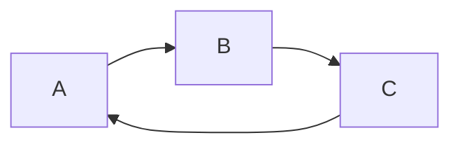

---
toc:
    depth_from: 1
    depth_to: 4
---


<!-- @import "[TOC]" {cmd="toc" depthFrom=1 depthTo=6 orderedList=false} -->

<!-- code_chunk_output -->

- [标题1](#标题1)
  - [标题2](#标题2)
  - [2标题](#2标题)
      - [标题4](#标题4)
        - [标题5](#标题5)

<!-- /code_chunk_output -->


# 标题1

## 标题2

## 2标题

### 标题3 {ignore=true}

#### 标题4

##### 标题5


普通内容

---
——————
***


- 无序列表
- 打卡机读卡


'Isn't this fun?'
"Isn't this fun?"
-- is en-dash, --- is em-dash

this is [a link][baidu]

</img>

[github](http://github.com)

[baidu]: http://www.baidu.com


---

> 这是一个引用哦
> 继续引用

---


dakjdak111111|jdakjdka11111111|djakdjka111111|
:--|:--:|--:|
dkadkal|dakldkal|dkadkla|

*斜体**出来**报到啦*

**我觉得你应该在这里使用`<addr>`才对**

`python:`
```python
# python
print('hello world');
print('hello world');
print('hello world');
```

`javascript:`
```javascript{.line-numbers,highlight=[1,3,5,6,7,9,10]}
console.log('hello wrold');
console.log('hello wrold');
console.log('hello wrold');
console.log('hello wrold');
console.log('hello wrold');
console.log('hello wrold');
console.log('hello wrold');
console.log('hello wrold');
console.log('hello wrold');
console.log('dajkdjakdja');
```

- [x] @mentions, #refs, [links](), **formatting**, and <del>tags</del> supported
- [x] list syntax required (any unordered or ordered list supported)
- [x] this is a complete item
- [ ] this is an incomplete item

name | 价格 |  数量
-|-|-
香蕉 | $1 | 5 |
苹果 | $1 | 6 |
草莓 | $1 | 7 |

First Header | Second Header
------------ | -------------
  |Content from cell 2
Content in the first column | Content in the second column

30^th^

content [^1]

[^1]: www.baidu.com

1. 七牛key
2. 自动打开预览侧板
3. 开启新行换行
4. 七牛bucket
5. 使用chrome导出文件
6. 代码快主题
7. 七牛域名
8. 开启critimarkup语法
9. 开启emoji语法
10. 转换视频音频链接成emmbed tags
11. 转换类似地址的普通文本成立链接
12. 开启脚本执行，注意安全性
13. 将ASCII标点字符转换为“智能”印刷标点HTML实体 比如--变成一
14. 开启wikilink的语法
15. 前置事项渲染格式
16. 是否允许http的媒体载入
17. 用![]语法载入html5妹子
18. html5的视频属性设置
19. 图片文件夹路径，需要image helper
20. magickpath命令
21. 图片上传模块
22. latex引擎的选择
23. 即时更新预览视图
24. 自定义数学表达式块定界符
25. 自定义数学表达式行内定界符

30^th^

H~2~O


[[nihao]]

&#60;HTML&#62;

Content [nihao]


*[HTML]: Hyper Text Markup Language
*[W3C]: World Wide Web Consortium
The HTML specification
is maintained by the W3C.

==dajdajkd==

{++add++}
{--dele--}
{~~nihao~>world~~}
==mark==
**dada**
*111*


20^2^

H~2~O


如今<abbr title="是指Model-View-Controller模式">MVC</abbr>模式越


<p>如今<abbr title="是指Model-View-Controller模式">MVC</abbr>模式越

来越被人们诟病，而使用

快速<abbr title="是create, read, update, delete四个词的首字母缩略">CRUD</abbr>生成开发

更是被一些著名程序员唾弃。</p>

The HTML specification is maintained by the W3C

==marked==

Lorem {~~hipsum~>ipsum~~} dolor sit amet…

Don't go around saying{-- to people that--} the world owes you a living. The world owes you nothing. It was here first. {~~One~>Only one~~} thing is impossible for God: To find {++any++} sense in any copyright law on the planet. {==Truth is stranger than fiction==}{>>strange but true<<}, but it is because Fiction is obliged to stick to possibilities; Truth isn’t.


Don't act so surprised, Your {~~Queen~>Highness~~}{>>@gsw sounds better<<}. You weren't on any mercy mission this time.

*[HTML]: Hyper Text Markup Language
*[W3C]: World Wide Web Consortium
The HTML specification
is maintained by the W3C.


$ f(x) = sin(x) +12 $

$$\sum_{n=1}^{100}=dadjak dakdajk+1212121212121$$


```flow
    ```flow
    open=>start: Open:>https://github.com/knsv/mermaid
    userInput=>inputoutput: User Input
    processes=>operation: Processes
    results=>condition: Yes or No?
    regis=>condition: GoSignUp,Yes or No?
    userr=>operation: SignUp
    end=>end: End
    open->userInput->processes->results
    results(yes)->end
    results(no)->regis
    regis(yes)->userr
    regis(no)->userInput
    ```
```
```flow
st=>start: start
op=>operation: My Operation
cond=>condition: Yes or No?
e=>end
st->op->cond
cond(yes)->e
cond(no)->op
```

```flow
st=>start: 开始
e=>end: 结束
c1=>condition: A
c2=>condition: B
c3=>condition: C
io=>inputoutput: D
st->c1(no)->e
c2(no)->e
c3(no)->e
c1(yes,right)->c2(yes,right)->c3(yes,right)->io
io->e
```

**jdakdjakdjad**

**djakdjakdjakdja**


`dakjdkajdakdakj`

```python
print(123)

```
> dakdajkd
> jdajdjka

----------

[wangi][^nihao]

[^nihao]: www.163.com

[wangi1][^nihao1]

[^nihao1]: www.163.com
