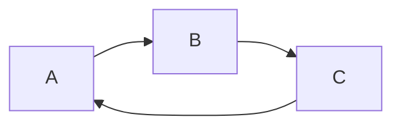

---
toc:
    depth_from: 1
    depth_to: 4
---  
  
  
  
  
  
  
  
- [标题1](#标题1 )
  - [标题2](#标题2 )
  - [2标题](#2标题 )
      - [标题4](#标题4 )
        - [标题5](#标题5 )
  
  
  
  
  
  
#  标题1
  
  
##  标题2
  
  
##  2标题
  
  
###  标题3
  
  
####  标题4
  
  
#####  标题5
  
  
  
普通内容
  
---
——————
***
  
  
- 无序列表
- 打卡机读卡
  
  
  
  
  
'Isn't this fun?'
"Isn't this fun?"
-- is en-dash, --- is em-dash
  
this is [a link][baidu]
  
</img>
  
[github](http://github.com )
  
[baidu]: http://www.baidu.com
  
  
---
  
> 这是一个引用哦
> 继续引用
  
---
  
  
dakjdak111111|jdakjdka11111111|djakdjka111111|
:--|:--:|--:|
dkadkal|dakldkal|dkadkla|
  
*斜体**出来**报到啦*
  
**我觉得你应该在这里使用`<addr>`才对**
  
`python:`
```python
# python
print('hello world');
print('hello world');
print('hello world');
```
  
`javascript:`
```javascript{.line-numbers,highlight=[1,3,5,6,7,9,10]}
console.log('hello wrold');
console.log('hello wrold');
console.log('hello wrold');
console.log('hello wrold');
console.log('hello wrold');
console.log('hello wrold');
console.log('hello wrold');
console.log('hello wrold');
console.log('hello wrold');
console.log('dajkdjakdja');
```
  
- [x] @mentions, #refs, [links]( ), **formatting**, and <del>tags</del> supported
- [x] list syntax required (any unordered or ordered list supported)
- [x] this is a complete item
- [ ] this is an incomplete item
  
name | 价格 |  数量
-|-|-
香蕉 | 1 | 6 |
草莓 |  f(x) = sin(x) +12 $
  
<p align="center"></p>  
  
  

```flow
    ```flow
    open=>start: Open:>https://github.com/knsv/mermaid
    userInput=>inputoutput: User Input
    processes=>operation: Processes
    results=>condition: Yes or No?
    regis=>condition: GoSignUp,Yes or No?
    userr=>operation: SignUp
    end=>end: End
    open->userInput->processes->results
    results(yes)->end
    results(no)->regis
    regis(yes)->userr
    regis(no)->userInput
    ```
```
```flow
st=>start: start
op=>operation: My Operation
cond=>condition: Yes or No?
e=>end
st->op->cond
cond(yes)->e
cond(no)->op
```
  
```flow
st=>start: 开始
e=>end: 结束
c1=>condition: A
c2=>condition: B
c3=>condition: C
io=>inputoutput: D
st->c1(no)->e
c2(no)->e
c3(no)->e
c1(yes,right)->c2(yes,right)->c3(yes,right)->io
io->e
```
  
**jdakdjakdjad**
  
**djakdjakdjakdja**
  
  
`dakjdkajdakdakj`
  
```python
print(123)
  
```
> dakdajkd
> jdajdjka
  
----------
  
[wangi][^nihao]
  
[^nihao]: www.163.com
  
[wangi1][^nihao1]
  
[^nihao1]: www.163.com
  